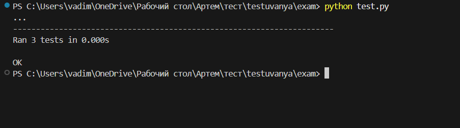

 # Практична частина білету 23
- Завдання: У файлі main.py напишіть функцію triangle_area(base, height), яка обчислює площу трикутника. Тест: У файлі test.py перевірте коректність формули та обробку нульових значень.


## Приклад виконання
- запускаємо програму:
  ```bash
  python test.py
  ```
- запускаємо тести:
```bash
python -m unittest -v
```
- результат
